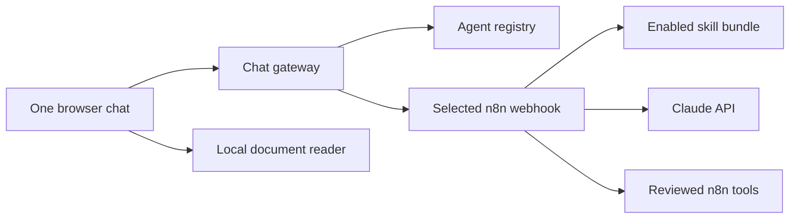

# Add another agent or workflow

The browser is a reusable agent shell. Agent choices come from one registry
instead of being hard-coded into separate applications.

## How a request moves

The reusable pieces are:

- `apps/chat/config/agents.json` — display names, status, prompts, and n8n
  webhook path;
- `apps/chat` — one UI and gateway for every agent;
- `services/document-worker` — shared PDF, DOCX, and TXT extraction;
- `skills` — small Markdown behaviour modules;
- `n8n/workflows` — visual orchestration and reviewed tool connections.

Project Manager, Sales, Marketing, Investment, and Bookkeeping are active. They
share one validated webhook, but the n8n Switch sends each request to a separate
AI Agent node. Tools are physically connected only to their owning role.

## Add a skill to an agent

1. Copy an existing directory below `skills`.
2. Give the new directory and `skill.yaml` the same lowercase kebab-case ID,
   and set its reviewed `agent` owner.
3. Write focused instructions in `SKILL.md`.
4. Add the ID to `skills/enabled.txt`.
5. Run `sync-skills.command` on macOS or `sync-skills-windows.cmd` on Windows.
6. Start a new conversation and test normal, ambiguous, and adversarial input.

The compiler validates metadata, agent ownership, size, duplicate IDs, and each
agent's instruction limit before n8n receives anything.

## Add a sixth agent

This is a technical-contributor task. Do not activate a sidebar button until
its workflow and safety tests are ready.

1. Extend the five-ID allow-lists in the compiler, workflow validator, runtime
   contract, and chat registry as one atomic change.
2. Add one new AI Agent node and Switch output in workflow `00`.
3. Apply the same request validation, document boundaries, response contract,
   timeout, and credential rules used by the existing five routes.
4. Connect only that role's reviewed tools. Reads may be automatic; consequential writes
   need an explicit proposal and confirmation design.
5. Assign every skill to an agent in `skill.yaml`. The schema-v2 bundle keeps
   all five validated groups in one stable `agent_config` row, and the runtime
   selects only the current agent's group.
6. Add the public definition to `apps/chat/config/agents.json` and both safe
   fallback registries.
7. Run `node scripts/validate-workflows.mjs`, then manually exercise valid,
   invalid, timeout, and safe-write paths in a throwaway local project.
8. Restart with `npm run restart`.
9. Verify the new button starts an isolated conversation and reaches only its
   intended webhook.

The gateway derives the internal n8n URL from the selected registry entry. It
never accepts an arbitrary workflow URL from the browser, which prevents users
from turning the chat endpoint into an open proxy.

## Rules for future service connections

- Keep credentials in n8n's encrypted credential store, never in browser code,
  Git, skills, or document text.
- Prefer one small n8n subworkflow per capability.
- Label every capability as read, proposal, write, or destructive.
- Make write tools idempotent and auditable.
- Require explicit confirmation for external messages, money movement,
  deletion, publication, and material record changes.
- Validate tool input again inside the subworkflow.
- Return small structured results to the agent.
- Add a mock-backed test before a new integration is used in a workshop.

This keeps the beginner surface simple while giving technical teams clean
extension points behind it.
