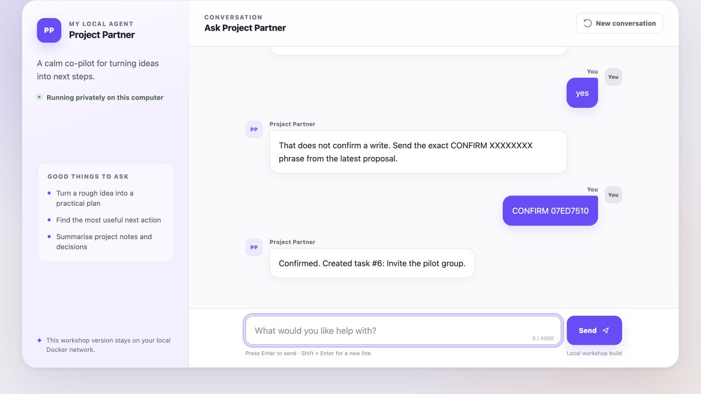

# Getting started — the complete beginner guide

## What you are making

You will create a private copy of this project and run an AI project assistant
on your own computer. You will open the assistant in a web browser, but it is
not published on the internet.

You do not need to know how to code. You will mostly:

1. click buttons in GitHub Desktop and Docker Desktop;
2. double-click the setup file for your computer;
3. connect your Claude API key inside n8n;
4. edit a few clearly labelled words;
5. save your changes with GitHub Desktop.

Allow 30–45 minutes for the first setup. The first Docker download is the
slowest part.

## Four names you will see

| Name | Plain-language meaning |
| --- | --- |
| GitHub | The website that stores your project files |
| GitHub Desktop | The app that copies those files to your computer and saves changes |
| Docker Desktop | The app that runs the project without installing developer tools |
| n8n | The visual canvas where you can see and change the AI agent |

Claude is the AI model. An Anthropic API key lets this local project call
Claude. A paid Claude web subscription and API credit are separate products.

## Before you begin

Have these ready:

- [ ] A GitHub account.
- [ ] GitHub Desktop installed and signed in.
- [ ] Docker Desktop installed, open, and reporting that its engine is running.
- [ ] An Anthropic Console API key with a small positive credit balance.
- [ ] About 5 GB of free disk space for Docker images and local data.
- [ ] A current Chrome, Edge, Firefox, or Safari browser.
- [ ] A stable internet connection for the first download and Claude calls.

Windows learners must use Windows 11 with WSL2 enabled. Follow the
[prerequisite guide](WORKSHOP_PREREQUISITES.md) if any checkbox is unfamiliar.

Keep the API key private. Never paste it into GitHub, GitHub Desktop, a chat
message, `.env`, a screenshot, or an issue. It belongs only in the n8n
credential screen described below.

## Part 1 — put your own copy on the computer

### Create the private repository

1. Open the project repository on GitHub.
2. Select **Use this template**.
3. Select **Create a new repository**.
4. Choose your own GitHub account as the owner.
5. Enter a short project name.
6. Choose **Private**.
7. Leave **Include all branches** switched off.
8. Select **Create repository**.

If **Use this template** is not visible, ask the instructor for the release ZIP.
Unzip it into a normal Documents folder; do not run it from inside the ZIP.

### Clone it with GitHub Desktop

1. In GitHub Desktop, choose **File → Clone repository**.
2. Select the repository you just created.
3. Keep the suggested local folder or choose a folder you can find again.
4. Select **Clone**.
5. Select **Show in Finder** on macOS or **Show in Explorer** on Windows.

You should now see `README.md`, `compose.yaml`, and several files ending in
`.command` or `.cmd`. The [GitHub Desktop guide](GITHUB_DESKTOP.md) has
screenshots-in-words for every save and push action.

## Part 2 — run the one-click setup

Leave Docker Desktop open.

### macOS

Double-click `setup.command`.

If macOS blocks it:

1. Control-click `setup.command`.
2. Choose **Open**.
3. Choose **Open** again in the confirmation window.

### Windows

Double-click `setup-windows.cmd`.

If Windows asks whether the script may make changes, check that the file is
inside your cloned project folder, then allow it.

### What setup is doing

The terminal window will:

- check Docker and the two local ports;
- make a private encryption key;
- download exact, versioned Docker images;
- build the chat app;
- start n8n and the chat;
- import eleven reviewed workflows;
- create three sample project tasks;
- load the enabled Markdown skills.

It is normal for the first run to pause while large files download. Do not close
the terminal or Docker Desktop. Setup is finished when it prints:

```text
Local stack is healthy.
  Chat app:          http://localhost:3000
  n8n editor:        http://localhost:5678
```

If setup stops, start with the [troubleshooting table](TROUBLESHOOTING.md).
Automatic import can safely be repeated with `import-workflows.command` on
macOS or `import-workflows-windows.cmd` on Windows.

## Part 3 — create the private local n8n owner

1. Open [http://localhost:5678](http://localhost:5678).
2. On the first visit, n8n asks you to create an owner account.
3. Enter an email-shaped username and a strong password you will remember.
4. Continue until the n8n Overview appears.
5. Open `01 - START HERE - Learner Checklist`.


This account exists only in the local Docker data on this computer. It is not
your GitHub, Anthropic, or n8n Cloud account.

## Part 4 — connect Claude safely

Turn off screen sharing before showing or pasting the key.

1. In n8n, open **Credentials**.
2. Choose **Create credential**.
3. Search for and choose **Anthropic**.
4. Name it `Anthropic account`.
5. Paste the key into **API Key**.
6. Save the credential.
7. Open `00 - START HERE - Project Partner`.
8. Open the node named **Claude - Sonnet 4.6**.
9. Select `Anthropic account` as its credential.
10. Save, then select **Publish**.
11. Open `90 - DEBUG - Agent Health`.
12. Select **Publish**.

The browser chat never receives the key. n8n stores it encrypted in the local
Docker volume.

## Part 5 — check that everything is ready

Close no windows; simply return to the project folder.

- macOS: double-click `diagnose.command`.
- Windows: double-click `diagnose-windows.cmd`.

The diagnostic never sends a Claude request and never displays the key. Follow
each yellow `[next]` instruction. You are ready when it says:

```text
All checks are green. The local agent is ready for a real Claude message.
```

## Part 6 — prove the agent works

Open [http://localhost:3000](http://localhost:3000).

Send these messages one at a time:

1. `Turn my project idea into three clear next steps.`
2. `What tasks are in my local project?`
3. `Create a high-priority task to invite the launch group.`

For the third message, the agent proposes an exact action. Check the fields, then
send the displayed `CONFIRM XXXXXXXX` phrase as a new message within five
minutes. Sending only `yes` must not create anything.



You have succeeded when:

- [ ] the first message receives a useful Claude reply;
- [ ] the second message lists local sample tasks;
- [ ] plain `yes` does not approve a write;
- [ ] the exact confirmation creates one task;
- [ ] refreshing the browser keeps the interface available.

## Part 7 — make it yours

### Change the interface

Open `apps/chat/public/agent.config.js` in a plain text editor. Change only the
quoted values described in [Customise the chat](CUSTOMISE_CHAT.md): the agent
name, welcome message, colour, and example prompts.

Save the file and refresh [http://localhost:3000](http://localhost:3000).

### Change one skill

Open `skills/project-assistant/SKILL.md`. Change one instruction without
removing its safety rules, then save.

- macOS: double-click `sync-skills.command`.
- Windows: double-click `sync-skills-windows.cmd`.

Start a new browser conversation so the new instruction is loaded. Follow
[Customise skills](CUSTOMISE_SKILLS.md) for examples.

## Part 8 — save your project

In GitHub Desktop:

1. Review the changed file names and make sure `.env` and `backups` are absent.
2. In **Summary**, type `Customise my project partner`.
3. Select **Commit to main**.
4. Select **Push origin**.
5. Open your GitHub repository and confirm the new commit is visible.

Local n8n accounts, credentials, tasks, and conversation memory are not uploaded
to GitHub. Only the project files you reviewed are pushed.

## Part 9 — stop safely and come back later

Before an experiment, create a private backup:

- macOS: double-click `backup.command`.
- Windows: double-click `backup-windows.cmd`.

Treat `backups/` like a password. It contains encrypted credentials plus the
matching encryption key.

To stop at the end of the day:

- macOS: double-click `stop.command`.
- Windows: double-click `stop-windows.cmd`.

To return later:

1. Open Docker Desktop and wait until it is ready.
2. Double-click `start.command` or `start-windows.cmd`.
3. Open [http://localhost:3000](http://localhost:3000).

Stopping preserves your local work. Reset is different: it permanently removes
the local n8n account, credentials, workflows, tasks, and history. Do not run a
reset unless you understand the [backup and recovery guide](LOCAL_OPERATIONS.md).

## When something does not work

Use this order:

1. Read the exact terminal or browser message once.
2. Confirm Docker Desktop is open and ready.
3. Run `diagnose.command` or `diagnose-windows.cmd`.
4. Follow its first yellow `[next]` instruction.
5. Search the [troubleshooting table](TROUBLESHOOTING.md).
6. Ask for help without sharing `.env`, an API key, a backup, or screenshots of
   the credential screen.

The two most useful local addresses are:

- Chat: [http://localhost:3000](http://localhost:3000)
- n8n: [http://localhost:5678](http://localhost:5678)

If one address is unavailable after a restart, wait one minute and run the
diagnostic again.
